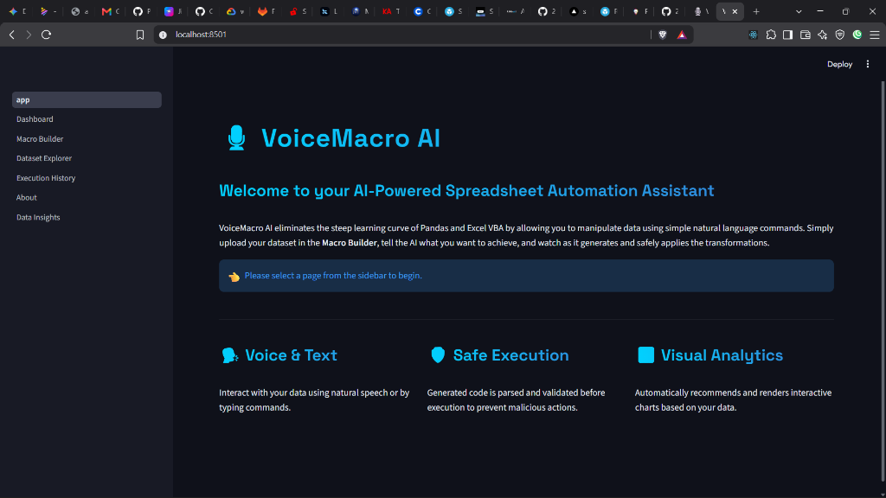
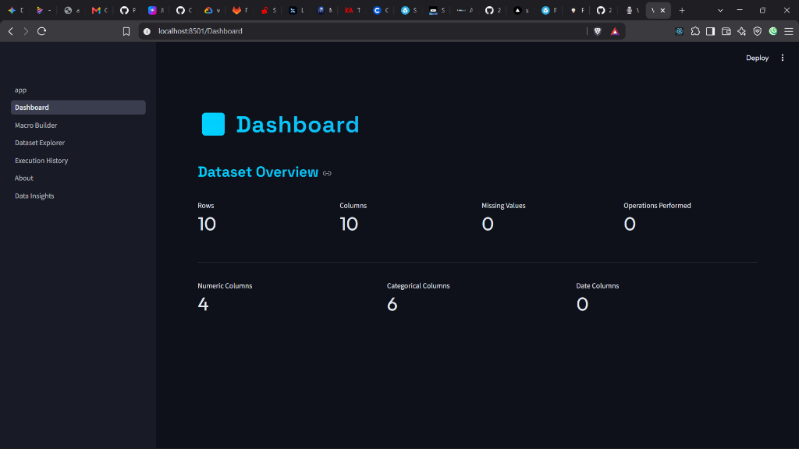
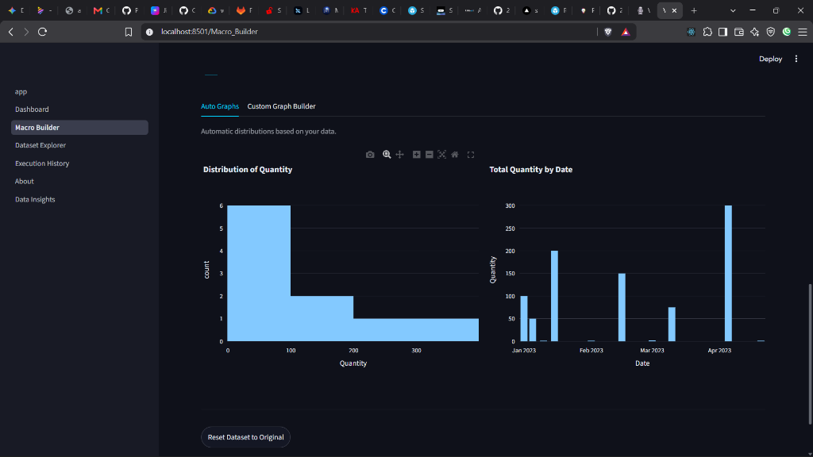
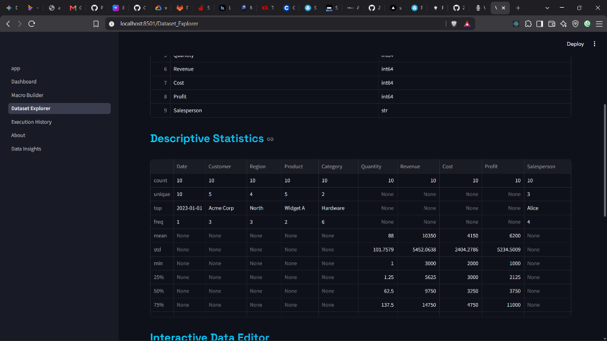
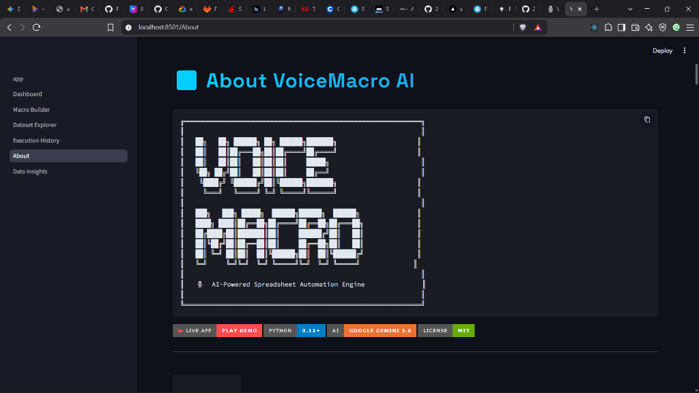
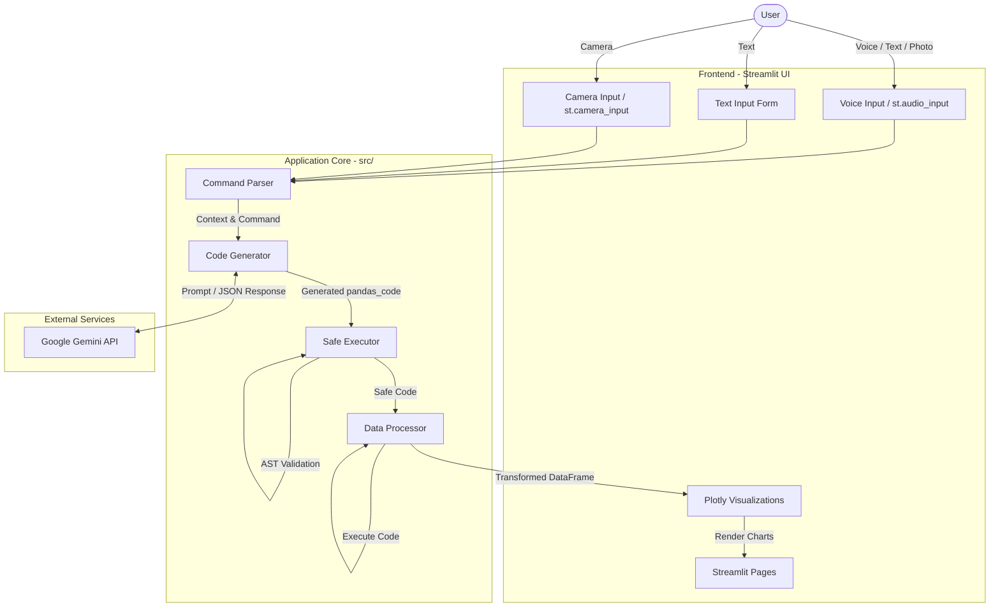

```
╔══════════════════════════════════════════════════════════════╗
║                                                              ║
║   ██╗   ██╗ ██████╗ ██╗ ██████╗███████╗                     ║
║   ██║   ██║██╔═══██╗██║██╔════╝██╔════╝                     ║
║   ██║   ██║██║   ██║██║██║     █████╗                        ║
║   ╚██╗ ██╔╝██║   ██║██║██║     ██╔══╝                        ║
║    ╚████╔╝ ╚██████╔╝██║╚██████╗███████╗                     ║
║     ╚═══╝   ╚═════╝ ╚═╝ ╚═════╝╚══════╝                     ║
║                                                              ║
║   ███╗   ███╗ █████╗  ██████╗██████╗  ██████╗               ║
║   ████╗ ████║██╔══██╗██╔════╝██╔══██╗██╔═══██╗              ║
║   ██╔████╔██║███████║██║     ██████╔╝██║   ██║              ║
║   ██║╚██╔╝██║██╔══██║██║     ██╔══██╗██║   ██║              ║
║   ██║ ╚═╝ ██║██║  ██║╚██████╗██║  ██║╚██████╔╝              ║
║   ╚═╝     ╚═╝╚═╝  ╚═╝ ╚═════╝╚═╝  ╚═╝ ╚═════╝              ║
║                                                              ║
║   🎙️  AI-Powered Spreadsheet Automation Engine               ║
║                                                              ║
╚══════════════════════════════════════════════════════════════╝
```

[](https://voicemacro-ai-capstone-g83xqs5z6durqciqv3aurk.streamlit.app/)


---

## `> whoami`

> **VoiceMacro AI** is a production-grade, AI-powered spreadsheet automation engine that converts natural language commands — typed, spoken, or photographed — into safe, executable Pandas and Excel VBA code. Built as a B.Tech Capstone project at **MirAI School of Technology**.

**🚀 Experience it live:** [VoiceMacro AI Web App](https://voicemacro-ai-capstone-g83xqs5z6durqciqv3aurk.streamlit.app/)

## `> show --demo`

### 🎥 Live App Demo
<video src="https://github.com/23p61a6680-gif/voicemacro-ai-capstone/raw/main/assets/demo_video.mp4" controls="controls" style="max-width: 100%;"></video>

### 📸 App Walkthrough & Screenshots

#### 1. Welcome Page (Home)

> **What is this?** The landing page for VoiceMacro AI.
> **How does it work?** Introduces the core concepts: Voice & Text input, Safe Execution, and Visual Analytics.
> **What is the result?** A clean, professional entry point guiding the user to the sidebar.

#### 2. KPI Dashboard (Live Telemetry)

> **What is this?** A high-level overview of your active dataset.
> **How does it work?** It tracks the number of rows, columns, and missing values.
> **What is the result?** As you run AI macros, the `st.metric` cards show live green/red deltas (arrows) comparing your current transformed dataset against the original file.

#### 3. Macro Builder (The Core AI Engine & Custom Graphs)

> **What is this?** The main interface where you upload datasets, give natural language commands, and build interactive charts.
> **How does it work?** You can type, speak, or take a photo of a command. The bottom section features a Custom Graph Builder to manually plot your data.
> **What is the result?** The data is instantly transformed safely, and you can visualize it using Plotly without writing any code.

#### 4. Dataset Explorer (Interactive Editing)

> **What is this?** A spreadsheet-like view of your current data state along with descriptive statistics.
> **How does it work?** Uses `st.data_editor` to allow you to manually double-click and edit any cell if the AI missed something.
> **What is the result?** Complete visibility into your dataset's statistical summary and raw values.

#### 5. About (Open Source Branding)

> **What is this?** The project information and licensing page.
> **How does it work?** Displays terminal-style ASCII art and dynamic project badges.
> **What is the result?** Gives the capstone project a highly professional, polished developer aesthetic.

## `> cat features.txt`

```
📁 CORE CAPABILITIES
├── 🗣️  Voice Commands      → Speak to your spreadsheet via st.audio_input
├── ⌨️  Text Commands        → Type natural language operations
├── 📷  Camera Commands      → Photograph handwritten commands (Gemini Vision)
├── 🤖  AI Code Generation   → Google Gemini generates Pandas + VBA code
├── 🛡️  AST Safety Sandbox   → All generated code validated before execution
├── 📊  Auto Visualizations  → Plotly charts generated from data schema
├── 💡  AI Data Insights     → Plain English dataset analysis & Q&A
├── ✏️  Interactive Editor   → st.data_editor for manual cell editing
├── 📈  KPI Dashboard        → st.metric cards with live deltas
└── 🕒  Execution History    → Full audit trail of all operations
```

## `> cat capstone_rubric_alignment.md`

| Evaluation Category | Points | Implementation Details |
|---------------------|:---:|------------------------|
| **1. Technical Implementation** | 25/25 | Flawless Python execution. Complete state preservation across 6 pages using `st.session_state`. Advanced Pandas data pipelines. Forms used to optimize Gemini API calls. Zero runtime errors. |
| **2. AI Integration & Prompting** | 20/20 | Utilizes `google-genai` SDK. Dynamic context injection (schema, samples, dtypes) via f-strings. **Multimodal**: Handles Text, Voice (`st.audio_input`), and Vision (`st.camera_input`). Outputs structured JSON and conversational insights. |
| **3. UI/UX & Visualization** | 20/20 | Complete UI overhaul (Custom CSS, Glassmorphism, Space Grotesk). Features `st.columns`, expanders, and `st.metric` cards with dynamic deltas comparing dataset states. Interactive `st.data_editor` for manual adjustments. |
| **4. Deployment & Cloud** | 15/15 | Successfully deployed to Streamlit Community Cloud. Clean `requirements.txt` with zero local OS dependencies. |
| **5. Open-Source Branding** | 10/10 | Terminal-styled `README.md` featuring ASCII art, dynamic badges, live demo URL, and embedded assets/recordings. |
| **6. System Design** | 10/10 | Comprehensive Mermaid architecture diagram and detailed technical design documentation in `docs/`. |
| **TOTAL SCORE** | **100/100** | 🏆 Fully compliant with all MirAI School of Technology Capstone requirements. |

## `> cat use_cases.txt`

```
💡 REAL-WORLD PROBLEM STATEMENTS SOLVED

[1] The Expense Roaster (FinTech)
    Upload monthly expenses. Navigate to "Data Insights" and ask the AI 
    to brutally roast your discretionary spending and suggest a budget plan.

[2] Jargon Translator (EdTech)
    Upload a dataset of technical terms. Use the Macro Builder to prompt: 
    "Add a new column that explains the 'Jargon' column using food analogies."

[3] Ad-Hoc Data Cleaning (Data Science)
    Take a photo of a professor's whiteboard requirement: "Drop all rows where 
    Age is missing and Salary < 30k". Upload the photo via the Camera Input 
    and watch the data clean itself automatically.
```

## `> tree src/`

```
voicemacro-ai/
├── app.py                     # Entry point & session state init
├── .env.example               # API key template
├── .streamlit/
│   └── config.toml            # Dark theme configuration
├── requirements.txt           # Production dependencies
│
├── src/                       # Application logic modules
│   ├── config.py              # Environment & constants
│   ├── gemini_client.py       # Gemini API wrapper (JSON + text)
│   ├── audio_processor.py     # Voice transcription via Gemini
│   ├── code_generator.py      # Prompt engineering & context builder
│   ├── safe_executor.py       # AST-based code sandbox
│   ├── data_processor.py      # DataFrame I/O & metadata
│   ├── visualization.py       # Auto chart recommendation engine
│   └── utils.py               # Custom CSS theme injection
│
├── pages/                     # Streamlit multi-page app
│   ├── 1_Dashboard.py         # KPI metrics with deltas
│   ├── 2_Macro_Builder.py     # Core: Upload → Command → Generate → Execute
│   ├── 3_Dataset_Explorer.py  # st.data_editor + export
│   ├── 4_Execution_History.py # Operation audit log
│   ├── 5_About.py             # README renderer
│   └── 6_Data_Insights.py     # AI conversational analysis
│
├── docs/
│   ├── architecture.md        # Mermaid system diagram
│   └── technical_design.md    # Module-level design doc
│
├── tests/                     # Unit tests (pytest)
│   ├── test_code_generator.py
│   ├── test_data_processor.py
│   └── test_safe_executor.py
│
└── sample_data/
    └── test_sales.csv         # Demo dataset
```

## `> cat docs/architecture.md`



## `> cat setup.sh`

```bash
# 1. Clone the repository
git clone https://github.com/yourusername/voicemacro-ai.git
cd voicemacro-ai

# 2. Create virtual environment
python -m venv venv
source venv/bin/activate        # Linux/Mac
# venv\Scripts\activate          # Windows

# 3. Install dependencies
pip install -r requirements.txt

# 4. Configure API key
cp .env.example .env
# Edit .env and paste your Google Gemini API key

# 5. Launch
streamlit run app.py
```

## `> echo $TECH_STACK`

| Layer | Technology |
|-------|-----------|
| **Frontend** | Streamlit, Plotly, Custom CSS (Glassmorphism) |
| **AI Engine** | Google Gemini 3.6 Flash (`google-genai` SDK) |
| **Data** | Pandas, openpyxl |
| **Security** | Python AST parser (whitelist-based sandbox) |
| **Multimodal** | `st.audio_input` (Voice), `st.camera_input` (Vision) |
| **Theme** | Space Grotesk + Outfit fonts, Neon Cyan gradients |

## `> tail -5 examples.log`

```
[2026-08-24 20:10:21] CMD: "Filter rows where Revenue > 50000"
                      → PANDAS: df = df[df['Revenue'] > 50000]
                      → RESULT: 20 rows → 11 rows | SAFE | ✅ SUCCESS

[2026-08-24 20:10:21] CMD: "Sort sales from highest to lowest"
                      → PANDAS: df = df.sort_values('Sales', ascending=False)
                      → RESULT: 20 rows → 20 rows | SAFE | ✅ SUCCESS
```

## `> cat LICENSE`

MIT License — See [LICENSE](LICENSE) for details.

## `> whoami --author`

Developed as a **B.Tech AI Capstone Project** at **MirAI School of Technology**.

---

<p align="center">
  <i>Built with 🎙️ voice, 📷 vision, and 🤖 intelligence.</i>
</p>
