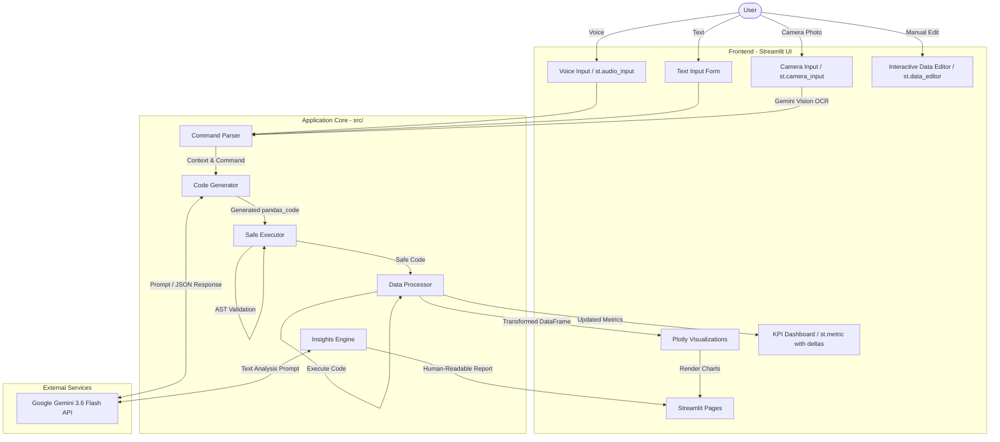

# System Architecture

## Overview
VoiceMacro AI is designed as a modular Streamlit application with a clean separation of concerns between UI presentation, data processing, AI integration, and code validation. It supports three input modalities: Text, Voice (Audio), and Camera (Vision).

## Architecture Diagram

## Data Flow
1. **Upload:** User uploads a CSV or Excel file. The `DataProcessor` loads it into `st.session_state`.
2. **Command Input:** User provides a natural language command via one of three modalities:
   - **Text:** Typed directly into `st.form`
   - **Voice:** Recorded via `st.audio_input`, transcribed by Gemini's multimodal audio capabilities
   - **Camera:** Captured via `st.camera_input`, read by Gemini Vision (OCR)
3. **AI Generation:** The `CodeGenerator` constructs a prompt including dataset metadata (columns, types, samples) and sends it to Gemini.
4. **Parsing:** Gemini returns a structured JSON containing intent, explanation, pandas code, and VBA code.
5. **Safety Validation:** The `SafeExecutor` parses the pandas code into an Abstract Syntax Tree (AST). It strictly verifies that the code only performs whitelisted data manipulation operations and does not contain dangerous function calls (e.g., `os`, `exec`, `eval`).
6. **Execution & Preview:** If safe, the user is prompted to execute. Upon execution, the code is run on a copy of the dataframe.
7. **Analytics:** The `VisualizationEngine` auto-generates Plotly charts based on the new dataframe schema. The Dashboard updates `st.metric` cards with live deltas showing changes from the original dataset.
8. **Insights:** The `Data Insights` page uses a separate text-generation prompt to provide human-readable, conversational analysis of the dataset without generating code.
